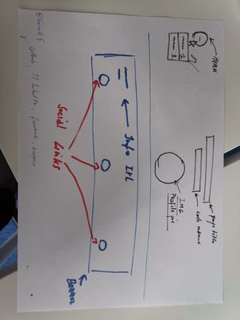
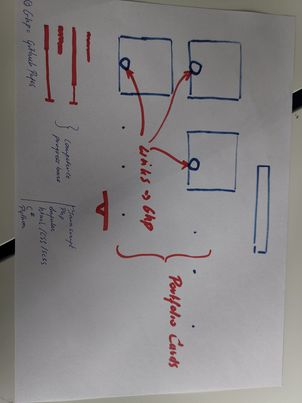

# my portfolio page
i started with my decision about what tool to use for this project; i could've used regular javascript and or php, html css but to try something new i decided to go with angular. this is going to be my first attempt at using this tool so bear with me.

## step one
* getting it online
__________________________________________________________________________
sinds i never really worked with angular, i gave myself the challenge to put it on github pages first. this proved to be harder to find than i thought. i had to change the "output-path" to "docs" and used the command: **ng buuild --output-path docs --base-href martekode.github.io**

this automatically deploys the page on github pages. BUT!! when i opened it it chowed the readme as the website. so i went into the settings on github of my repo and changed the /root to /docs and now it workes.

**now i can start working on the app...**
[Link to the site]( https://martekode.github.io/)

____________________________
added **@angular/material** and deleted the starter page already provided by angular/core. it now just gives the title and my name to begin with.

## 1
i started with my name and title of the page as stated before. after this i iported a menu module bacause i think i want to use it later.
* so:
____________________________
```
ng g c menu
```
this was to generate the component
```html
<app-menu></app-menu>
```
added it to my app.component.html file 
_______________
then i went into my component html file and copied the tags from angular material.
```html
<button class="menuBtn" mat-button [matMenuTriggerFor]="menu">Menu</button>
<mat-menu #menu="matMenu">
  <button mat-menu-item>section one</button>
  <button mat-menu-item>section 2</button>
</mat-menu>	
```
after this i had to import it to the app.module.ts file
```ts
import {MatMenuModule} from '@angular/material/menu';
@NgModule ({
  imports: [
    BrowserModule,
    BrowserAnimationsModule,
    MatMenuModule
  ],
})
```
after this i also styles a bit where i implemented a dark theme background for the body #212121  and accent colors darkorchid.
* i started to draw the lay-out i wanted on a piece of paper. Yes!!! I know, I know,... That's not THE way. But it's my way.
_______________________



let's try to make this...
so i started with the banner, i went to material and went to the examples of the card components. i found a card with a title, subtitle, some text, a devider, buttons and a progress bar that's animated. i took this one sinds it had to most appeal to me. 
adding it gave me some errors. it said that it didn't know devider and progress bar.. at the time i didn't know why. But now i know. Sinds i only imported the card module, it obvously didn't know the devider and p-bar because i didn't import them. it's pretty easy when the ide tells you it doesn't know it. search for an import.

```html
<mat-card class="example-card">
  <mat-card-subtitle>Dog Breed</mat-card-subtitle>
  <mat-card-title>Shiba Inu</mat-card-title>
  <mat-card-content>
    <p>This card has divider and indeterminate progress as footer</p>
    <p>{{ longText }}</p>
  </mat-card-content>
  <mat-divider inset></mat-divider>
  <mat-card-actions>
    <button mat-button>LIKE</button>
    <button mat-button>SHARE</button>
  </mat-card-actions>
  <mat-card-footer>
    <mat-progress-bar mode="indeterminate"></mat-progress-bar>
  </mat-card-footer>
</mat-card>
´´´
this is how it started...
i changed it though, to this.:
```html
<mat-card class="example-card bg-dark">
    <mat-card-subtitle>Info Brian Desmedt</mat-card-subtitle>
    <mat-card-title>Personal Info</mat-card-title>
    <mat-card-content>
    <p>{{ longText }}</p>
    <div class="container">
    <table class="tableContainer">
       <tr>
            <th>name:</th>
            <th>phone number:</th>
            <th>hobbies:</th>
            <th>email:</th>
          </tr>
          <tbody>
            <td>{{realName}}</td>
            <td>{{realPhone}}</td>
            <td>{{realHobbies[0]+", "+realHobbies[1]+", "+realHobbies[2]+", "+ realHobbies[3]+"."}}</td>
            <td>{{realEmail}}</td>
          </tbody>
    </table>
</div>

    </mat-card-content>
    <mat-divider inset></mat-divider>
    <mat-card-actions>
      <button mat-button>facebook</button>
      <button mat-button>github</button>
    </mat-card-actions>
    <mat-card-footer>
      <mat-progress-bar class="redProgress" mode="indeterminate"></mat-progress-bar>
    </mat-card-footer>
  </mat-card>
```
notice the variables in the table. It is amazing that u can change the content in the ts file and refer to it in the view.
i didn't imediatly found a way to use foreach here to print this. i could make a function in the ts and then call it in the vieuw.

i wanted to change the css of progress bar but that seemed difficult but i found it:
* first i started writing the css: 
```css
.redProgress .mat-progress-bar-fill::after{
    background-color: red !important;
}
```
u can talk to the mat-progress-bar directly but when u only this it will not work. sinds it works with a theme ftom material itself, it is not as easy to overwrite. but u can disable the theme with encapsulation..
```ts
@Component({
  selector: 'app-info-banner',
  templateUrl: './info-banner.component.html',
  styleUrls: ['./info-banner.component.css'],
  encapsulation: ViewEncapsulation.None,
})
```
and now it works.. i have a red progress bar. 
